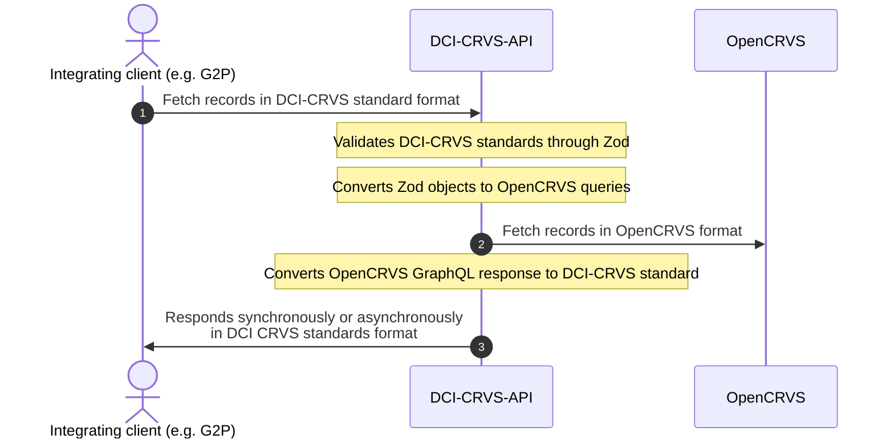

# DCI CRVS API

This repository provides [DCI standards](https://github.com/spdci/standards) compliant API for CRVS systems. It communicates between OpenCRVS and any other system that can communicate using the DCI standard.

DCI API standards reference can be found [in SPDCI docs](https://spdci.github.io/standards/release/html/registry_core_api_v1.0.0.html).

The package is a Node & TypeScript project and the API is built using [Hapi](https://hapi.dev/) as per OpenCRVS convention.

## Prerequisites

- Existing OpenCRVS installation
- [Node.js](https://nodejs.org/en/) (specified in [.nvmrc](./.nvmrc), recommend using [nvm](https://github.com/nvm-sh/nvm))

## Local development

Developing locally assumes that you have an running OpenCRVS installation. Integration system client details will be created as a system admin in OpenCRVS web UI.
In local development you are able to get a local registrar's token with [OpenCRVS DevTool](https://is-my-opencrvs-up.netlify.app/) Token generator.

1. Clone the repository
2. Run `npm install` to install dependencies
3. [See OpenCRVS documentation](https://documentation.opencrvs.org/technology/interoperability/create-a-client) for more details how to create a **record search** client.
4. [Authenticate your client](https://documentation.opencrvs.org/technology/interoperability/authenticate-a-client) to get a JWT token to query the API with. This is supplied with `Authorization: Bearer <<token>>` -header.
5. Run `npm run dev` to start the server

## Roadmap

dci-crvs-api validates the requests using Zod in [http-api/validations](./packages/http-api/src/validations.ts) and the supported parameters can be figured out using `maybeEncryptedSyncSearchRequestSchema` and `maybeEncryptedAsyncSearchRequestSchema` schemas.

| Endpoint                      | Description                                                                              | Implementation status            |
| ----------------------------- | ---------------------------------------------------------------------------------------- | -------------------------------- |
| `/health`                     | Health check endpoint                                                                    | ✅ dci-crvs-api@1.0.0            |
| `/oauth2/client/token`        | Get a JWT token with OpenCRVS National System Admin supplied client_id and client_secret | ✅ dci-crvs-api@1.0.0            |
| `/registry/search`            | Search person(s) in registry using an identifier or custom attributes (async, callback)  | ✅ dci-crvs-api@1.0.0            |
| `/registry/sync/search`       | Search person(s) in registry using an identifier or custom attributes (sync)             | ✅ dci-crvs-api@1.0.0            |
| `/.well-known/jwks.json`      | Exports a JSON Web Key Set containing CRVS public keys                                   | ✅ dci-crvs-api@1.0.0            |
| `/.well-known/locations.json` | Contains the location tree of a CRVS using SPDCI `Place`                                 | ✅ dci-crvs-api@1.0.0            |
| `/registry/subscribe`         | Notify a social protection system with webhooks about deaths                             | ⏩ Upcoming for dci-crvs-api@2.0 |

## Monorepo structure

| Package                                                | Description                                                                    |
| ------------------------------------------------------ | ------------------------------------------------------------------------------ |
| [`http-api`](/packages/http-api)                       | Handles HTTP input & output, payload encryption, validation of JWTs            |
| [`dci-opencrvs-bridge`](/packages/dci-opencrvs-bridge) | Converts data from DCI schemas to OpenCRVS search queries and vice versa       |
| [`opencrvs-api`](/packages/opencrvs-api)               | Allows fetching data from OpenCRVS, handles all communication to a CRVS system |
