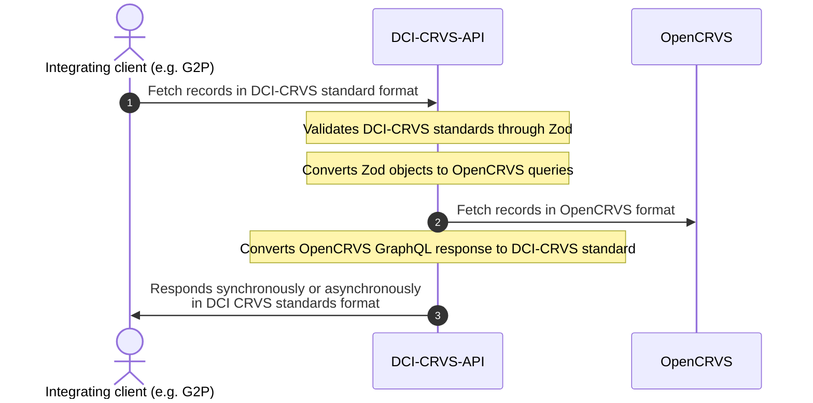

# DCI CRVS API

```mermaid
sequenceDiagram
    autonumber
    actor Integrating client (e.g. G2P)
    Integrating client (e.g. G2P)->>DCI-CRVS-API: Fetch records in DCI-CRVS standard format
    Note over DCI-CRVS-API: Validates DCI-CRVS standards through Zod
    Note over DCI-CRVS-API: Converts Zod objects to OpenCRVS queries
    DCI-CRVS-API->>OpenCRVS: Fetch records in OpenCRVS format
    Note over DCI-CRVS-API: Converts OpenCRVS GraphQL response to DCI-CRVS standard
    DCI-CRVS-API->>Integrating client (e.g. G2P): Responds synchronously or asynchronously<br>in DCI CRVS standards format
```

This repository provides a [DCI standards](https://github.com/spdci/standards)-compliant API for CRVS systems. It bridges OpenCRVS with any system that can communicate using the DCI CRVS v1.0.0 interface.

DCI API standards reference can be found [in SPDCI docs](https://api.spdci.org/release/html/crvs_api_v1.0.0.html).

The package is a Node & TypeScript project and the HTTP API is built using [Hapi](https://hapi.dev/).

## Prerequisites

- Existing OpenCRVS installation
- [Node.js](https://nodejs.org/en/) (specified in [.nvmrc](./.nvmrc), recommend using [nvm](https://github.com/nvm-sh/nvm))

## Local development

Developing locally assumes you already have a running OpenCRVS installation. Integration client details are created by a National System Admin in the OpenCRVS web UI.
For local development, you can generate a local registrar token using [OpenCRVS DevTool](https://is-my-opencrvs-up.netlify.app/).

1. Clone the repository
2. Run `npm install` to install dependencies
3. [See OpenCRVS documentation](https://documentation.opencrvs.org/technology/interoperability/create-a-client) for more details how to create a **record search** client.
4. [Authenticate your client](https://documentation.opencrvs.org/technology/interoperability/authenticate-a-client) to get a JWT token. Send it using the `Authorization: Bearer <token>` header.
5. Run `npm run dev` to start the server

## Testing

- Run all workspace tests: `npm test`
- Run HTTP API tests only: `npm run test --workspace=http-api`
- Run bridge tests only: `npm run test --workspace=dci-opencrvs-bridge`

## Roadmap

dci-crvs-api validates requests using Zod in [`packages/http-api/src/validations.ts`](./packages/http-api/src/validations.ts). Supported request shapes are defined by `maybeEncryptedSyncSearchRequestSchema` and `maybeEncryptedAsyncSearchRequestSchema`.

| Endpoint                      | Description                                                                              | Implementation status |
| ----------------------------- | ---------------------------------------------------------------------------------------- | --------------------- |
| `/health`                     | Health check endpoint                                                                    | ✅                    |
| `/oauth2/client/token`        | Get a JWT token with OpenCRVS National System Admin supplied client_id and client_secret | ✅                    |
| `/registry/search`            | Search person(s) in registry using an identifier or custom attributes (async, callback)  | ✅                    |
| `/registry/sync/search`       | Search person(s) in registry using an identifier or custom attributes (sync)             | ✅                    |
| `/.well-known/jwks.json`      | Exports a JSON Web Key Set containing CRVS public keys                                   | ✅                    |
| `/.well-known/locations.json` | Contains the location tree of a CRVS using SPDCI `Place`                                 | ✅                    |

## Monorepo structure

| Package                                                | Description                                                              |
| ------------------------------------------------------ | ------------------------------------------------------------------------ |
| [`http-api`](/packages/http-api)                       | HTTP server                                                              |
| [`dci-opencrvs-bridge`](/packages/dci-opencrvs-bridge) | Converts data from DCI schemas to OpenCRVS search queries and vice versa |
